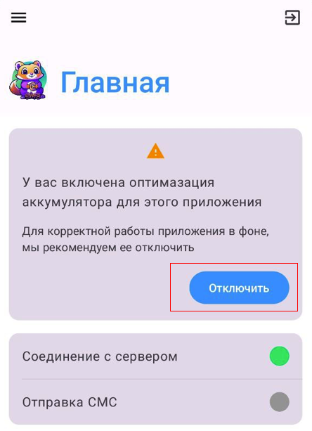

# How to Disable Activity Control (Power Control) for Android Apps

Activity control or power control might limit app functionality in the background to save battery. To disable this for a specific app, follow these steps:

> <figure markdown="span">
  { width="200" }
  <figcaption>You will receive notifications from the application, you can disable control by clicking on the button (Disable). If for some reason you are not transferred to the optimization settings, you can disable control using the instructions below.  </figcaption>
</figure>

<iframe width="720" height="405" src="https://rutube.ru/play/embed/70ef371116a1b7786a90461da6d63cd1/" frameBorder="0" allow="clipboard-write; autoplay" webkitAllowFullScreen mozallowfullscreen allowFullScreen></iframe>

1. *Open your device settings:*
   Find and tap the "Settings" icon.

2. *Navigate to the "Apps" or "Programs" section:*
   Depending on your phone model and Android version, this section may have different names.

3. *Find the required app:*
   Browse the list of installed apps and select the one for which you want to disable activity control.

4. *Open battery settings for this app:*
   Tap on *"Battery"* or *"Battery usage"*.

5. *Disable battery optimization:*
   Tap on *"Battery optimization"* or a similar option.

6. *Select "Don't optimize" or "No restrictions":*
   A list of apps will appear. Find your app and select *"Don't optimize"* or *"No restrictions"*. You might need to choose "All apps".

7. *Check other settings:*
   Some devices have additional settings such as *"Background restrictions"* or *"Background activity"*, which should also be disabled.

> ⚠️ *Important:* Disabling activity control might increase battery usage.