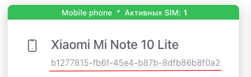
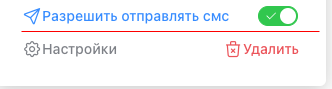
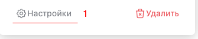
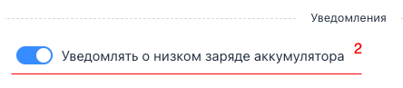
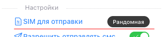

## Получение информации об устройстве

Вы должны использовать `POST` `/devices/get/info` <div style="font-size:12px">Более подробную информацию вы можете найти в <a href="https://docs.gosms.ru/request" target="_blank">Запросах</a></div>

<br>

#### Пример запроса

``` json title="POST: /devices/get/info"
{
  "device_id": "b1277815-fb6f-45e4-b87b-8dfb86b8f0a2"  			// string (*required)
}
```

|Ключ |Тип |Маркер | Значения|
|:------------------------ |:- |:- |:- |
| `id`|string |<b style="color:#b13f3f">*обязательный</b> | Идентификатор устройства.  Посмотреть его можно в панели управления в разделе  - [Мои устройства](https://cms.gosms.ru/devices)|


#### Успешный ответ
<div style="font-size:12px">Более подробную информацию вы можете найти в <a href="https://docs.gosms.ru/responses" target="_blank">Ответах</a></div>

``` json title="HTTP 200 application-json"
{
    "device_id": "b1277815-fb6f-45e4-b87b-8dfb86b8f0a2",
    "device_battery_state": 100,
    "device_name": "Xiaomi Mi Note 10 Lite",
    "is_active": false,
    "is_charging": false,
    "last_online_date": "1970-01-21T00:53:51.222Z",
    "device_name_type": "Mobile phone",
    "low_battery_alert": true,
    "to_sim": -2,
    "sim_list": [
        {
            "slot_index": 0,
            "display_name": "Tinkoff"
        },
        {
            "slot_index": 1,
            "display_name": "T-Mobile"
        }
    ]
}
```

|Ключ |Тип | Значения|
|:------------------------ |:- |:- |
| `device_id`|string | Идентификатор вашего физического `android` устройства, на котором установлено приложение `GoSMS`. |
| `device_battery_state`|string | Заряд аккумулятора в процентах. |
| `device_name`|string | Имя устройства, определяется автоматически. |
| `is_active`|boolean | Может отправлять SMS или нет.  <br>Включить примем SMS можно в панели управления- [Мои устройства](https://cms.gosms.ru/devices). |
| `is_charging`|boolean | Показывает, заряжается ли ваше устройство в данный момент. |
| `last_online_date`|string | Время последнего соединения устройства в нашей системе. Устройство раз в 5 минут дает нашей системе знать, активно ли оно. Можете ориентироваться по этому параметру, если с указанной даты прошло больше 5 минут, значит по каким то причинам, устройство не соединяется с нашей системой. |
| `device_name_type`|string | Название типа устройства. |
| `low_battery_alert`|boolean | Влючено ли оповещение о низком заряде аккумулятора. <br>  <br>  |
| `to_sim`|number | SIM Карта установленная по умолчанию для устройства. <br> <br> <kbd>-2</kbd> - "Дефолтная" Аппарат отправляет SMS с SIM карты которая установлена поумолчанию в самом аппарате,<br> <kbd>-1</kbd> - "Рандамноая" Аппарат будет отправлять SMS рандомно выбирая SIM карты,<br> <kbd>0</kbd> - "Соответствует 1 слоту SIM карты в аппарате",<br> <kbd>1</kbd> - "Соответствует 2 слоту SIM карты в аппарате",<br><br> *Нумерация слотов у аппарата начинается с нуля (0) |
| `sim_list`|array | Массив установленных сим карт в аппарате, имеет два ключа <br>(`slot_index` - number: Номер физического слота)<br> (`display_name` - string: Название оператора SIM карты) |

## Отправка SMS

Вы можете управлять состоянием аппарата. Разрешить отправку SMS или запретить


Вы должны использовать `POST` `/devices/edit` <div style="font-size:12px">Более подробную информацию вы можете найти в <a href="https://docs.gosms.ru/request" target="_blank">Запросах</a></div>

<br>

#### Пример запроса

``` json title="POST: /devices/edit"
{
  "device_id": "b1277815-fb6f-45e4-b87b-8dfb86b8f0a2", // string (*required)
  "is_active": true                                    // boolean (optional)
}
```

|Ключ |Тип |Маркер | Значения|
|:------------------------ |:- |:- |:- |
| `device_id`|string |<b style="color:#b13f3f">*обязательный</b> | Идентификатор устройства.  <br>Посмотреть его можно в панели управления в разделе  - [Мои устройства](https://cms.gosms.ru/devices)|
| `is_active`|boolean |`необязательный`| Для включения возможности отправки SMS этому устройству, вы должны передать булевое значение `true` для деактивации `false`.|

#### Успешный ответ
<div style="font-size:12px">Более подробную информацию вы можете найти в <a href="https://docs.gosms.ru/responses" target="_blank">Ответах</a></div>

- <b style="color:rgb(29, 129, 39)">HTTP 204 </b><b>No Content</b>


## Удаление

Вы должны использовать `POST` `/devices/del` <div style="font-size:12px">Более подробную информацию вы можете найти в <a href="https://docs.gosms.ru/request" target="_blank">Запросах</a></div>

<br>

#### Пример запроса

``` json title="POST: /devices/del"
{
  "device_id": "b1277815-fb6f-45e4-b87b-8dfb86b8f0a2" // string (*required)
}
```

|Ключ |Тип |Маркер | Значения|
|:------------------------ |:- |:- |:- |
| `device_id`|string |<b style="color:#b13f3f">*обязательный</b> | Идентификатор устройства.  <br> Посмотреть его можно в панели управления в разделе  - [Мои устройства](https://cms.gosms.ru/devices)|

#### Успешный ответ
<div style="font-size:12px">Более подробную информацию вы можете найти в <a href="https://docs.gosms.ru/responses" target="_blank">Ответах</a></div>

- <b style="color:rgb(29, 129, 39)">HTTP 204 </b><b>No Content</b>